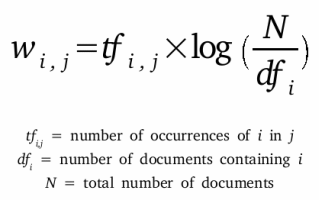

See my notebook "toxic-comments-projects.ipynb" for now.

# Automated Moderation
**Identifying Toxic Comments**

## Andrew Kin-Yip Chien
[Linkedin](https://www.linkedin.com/in/andrew-k-chien/) | [Github](https://github.com/kchien3) | [Slides](https://github.com/kchien3/toxic-comments-project/blob/master/presentation/toxic_comments_project-slides.pdf)

## Table of Contents

* [Background and Motivation](#background-and-motivation)
* [Data](#data)
  * [Description](#description)
* [Feature Engineering](#feature-engineering)
* [Exploration](#exploration)
* [Revenue Maximization Strategies](#revenue-maximization-strategies)
* [Conclusions](#conclusions)
* [Future Directions](#future-directions)
* [References](#references)

## Background and Motivation
Comments sections abound on various websites to facilitate discussion and engagement between users. However, toxic and abusive comments can quickly derail discussions and cause users to permanently refrain from commenting in the future and the scale of the problem is huge.

[11,000 comments](www.nytimes.com/interactive/2016/09/20/insider/approve-or-reject-moderation-quiz.html) are posted to the New York Times website every day. Over 160 million comments are posted to Reddit every month. Websites employ full-time human moderators to enforce policies of civility but the job [negatively affects](https://www.theverge.com/2019/2/25/18229714/cognizant-facebook-content-moderator-interviews-trauma-working-conditions-arizona) their mental health.

Machine learning methods can provide solutions that limit moderators' exposure to damaging content and moderate consistently and efficiently at scale. In this project I will build an auto-moderator, in other words, a model to classify whether comments are toxic or not.

## Data
### Description
160,000 comments from Wikipedia discussion pages were annotated by up to 10 human raters through the crowd-sourcing platform Crowdflower. Comments were rated on whether they were toxic or not (meaning whether they were likely to make people leave a discussion.) Additionally, five toxic subtypes that are not mutually exclusive were also annotated (severe toxic, obscene, threat, insult, identity hate), but the features were not used to build models in this project.  

This project uses a [modified version](https://www.kaggle.com/c/jigsaw-toxic-comment-classification-challenge/data) of the data set from a kaggle competition in order to benchmark model performance, but the unmodified data is [available](https://figshare.com/articles/Wikipedia_Talk_Labels_Toxicity/4563973) from Wikipedia.

## Feature Engineering
Text must be converted into numeric features for machine learning methods to train on.

41 features were manually created, consisting of counts of sets of characters, proportions of sets of characters, counts and proportions of words, counts of lines, and average lengths of words and lines in each comment.
### Text Vectorization
Another way to convert text into numeric data is by vectorization. Word or character level n-grams can be converted into count vectors or tf-idf vectors.  
#### Term Frequency-Inverse Document Frequency

## Exploration

## References
* Etim, Bassey. “Approve or Reject: Can You Moderate Five New York Times Comments?” *New York Times* 20 Sept. 2016, www.nytimes.com/interactive/2016/09/20/insider/approve-or-reject-moderation-quiz.html
* Newton, Casey. “The Secret Lives of Facebook Moderators in America.” *The Verge* 25 Feb. 2019, www.theverge.com/2019/2/25/18229714/cognizant-facebook-content-moderator-interviews-trauma-working-conditions-arizona.
