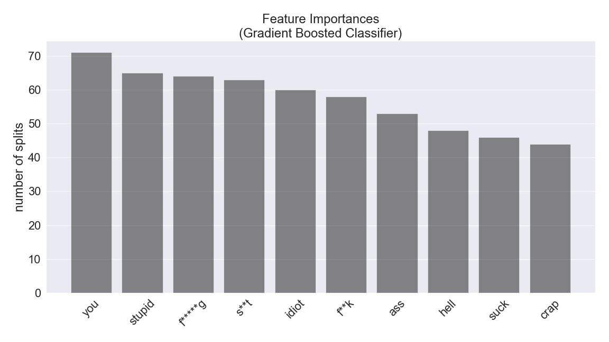

See my [notebook](https://github.com/kchien3/toxic-comments-project/blob/master/notebooks/toxic_comments_project.ipynb) for now.

# Automated Moderation
**Identifying Toxic Comments**

## Andrew Kin-Yip Chien
[Linkedin](https://www.linkedin.com/in/andrew-k-chien/) | [Github](https://github.com/kchien3) | [Slides](https://github.com/kchien3/toxic-comments-project/blob/master/presentation/toxic_comments_project-slides.pdf)

## Table of Contents

* [Background and Motivation](#background-and-motivation)
* [Data](#data)
  * [Description](#description)
* [Feature Engineering](#feature-engineering)
  * [Text Vectorization](#text-vectorization)
* [Exploration](#exploration)
  * [Important Words](#important-words)
  * [Distributions](#distributions)
* [Modeling](#modeling)
  * [Train/Test Split](#traintest-split)
  * [Class Imbalance](#class-imbalance)
  * [Elastic Net Logistic Regression](#elastic-net-logistic-regression)
  * [LightGBM Gradient-Boosted Classifier](#lightgbm-gradient-boosted-classifier)
  * [Linear Soft Support Vector Machine](#linear-soft-support-vector-machine)
  * [Multinomial Naive Bayes](#multinomial-naive-bayes)
* [Conclusions](#conclusions)
* [Future Directions](#future-directions)
* [References](#references)

## Background and Motivation
Comments sections abound on various websites to facilitate discussion and engagement between users. However, toxic and abusive comments can quickly derail discussions and cause users to permanently refrain from commenting in the future and the scale of the problem is huge.

[11,000 comments](www.nytimes.com/interactive/2016/09/20/insider/approve-or-reject-moderation-quiz.html) are posted to the New York Times website every day. Over 160 million comments are posted to Reddit every month. Websites employ full-time human moderators to enforce policies of civility but the job [negatively affects](https://www.theverge.com/2019/2/25/18229714/cognizant-facebook-content-moderator-interviews-trauma-working-conditions-arizona) their mental health.

Machine learning methods can provide solutions that limit moderators' exposure to damaging content and moderate consistently and efficiently at scale. In this project I will build an auto-moderator, in other words, a model to classify whether comments are toxic or not.

## Data
### Description
160,000 comments from Wikipedia discussion pages were annotated by up to 10 human raters through the crowd-sourcing platform Crowdflower. Comments were rated on whether they were toxic or not (meaning whether they were likely to make people leave a discussion.) Additionally, five toxic subtypes that are not mutually exclusive were also annotated (severe toxic, obscene, threat, insult, identity hate), but the features were not used to build models in this project.  

This project uses a [modified kaggle competition version](https://www.kaggle.com/c/jigsaw-toxic-comment-classification-challenge/data) of the data set in order to benchmark model performance, but the unmodified data is [available](https://figshare.com/articles/Wikipedia_Talk_Labels_Toxicity/4563973) from Wikipedia.

## Feature Engineering
Text must be converted into numeric features for machine learning methods to train on.

41 features were manually created, consisting of counts of sets of characters, proportions of sets of characters, counts and proportions of words, counts of lines, and average lengths of words and lines in each comment.

### Text Vectorization
Another way to convert text into numeric data is by vectorization. Word or character level n-grams can be converted into count vectors or tf-idf vectors.  

#### Term Frequency-Inverse Document Frequency

Term frequency-inverse document frequency is a statistic that reflects how important a word is to a document in a corpus. The more frequent a word is within a document and the fewer the documents the word appears in, the higher its tf-df value.

After appropriate train-test splitting of the data set, tf-idf vectorization resulted in a vocabulary close to 60,000 -- in other words, 60,000 features for models to train on.

## Exploration
### Important Words
Tf-idf vectorization was used to rank word importances within the toxic and nontoxic comment classes. The top 10 unique words within each class are (not ordered by importance):  
Toxic: ass, bitch, dick, don', f\*\*k, f\*\*\*ing, like, s\*\*t, stop, stupid, suck.  
Nontoxic: article, good, help, new, section, thank, time, use, 've, wp.  

There is already a clear pattern in the language used in toxic versus nontoxic comments.  

### Distributions
I would like to highlight two interesting differences between toxic and nontoxic comments.

One:

It can be observed that toxic comments (green) tend to be shorter (have fewer characters) than nontoxic comments (black). But toxic comments are also longer, as can be seen by the small peak at the right edge of the graph. Long comments (5000 characters) tend to be strings repeated until the character limit is reached.

 
 
Two:

It can be observed that toxic comments (green) tend to contain a higher proportion of uppercase characters than nontoxic comments (black). All capitalized text typically indicates shouting and it makes sense that toxic comments have an associated shouting/angry tone.

 
Only tfidf values were used as features for modeling.

## Modeling
### Train/Test Split
The comments were split into a 75% training fold and 25% testing fold to preserve the class imbalance in the test fold.

### Class Imbalance
Approximately 10% of the comments belong to the toxic class, with the remaining comments belonging to the nontoxic class. Highly imbalanced classes will lead to models that perform poorly at identifying the minority class unless the imbalance is specifically addressed. There are various methods for addressing imbalance, including upsampling, downsampling, and changing sample weights in model fit functions. Here we will downsample the majority class to produce a class-balanced training set.

  
A number of model algorithms were used to build classifiers. The choice of character and word n-grams were investigated within each classifier and unigrams produced models with the lowest cross-validation loss. Some classifiers are highlighted below.

### Elastic Net Logistic Regression
A logistic regression classifier with an elastic net regularization was fit to the training data with hyperparameters tuned by 5-fold cross-validation.

The red bars correspond to the five features most indicative of a toxic comment. They are words that typically have negative valence. The blue bars are features most indicative of nontoxic comments. The heights of the bars correspond to the exponentiated feature coefficients in the classifier with the interpretation that a 1% increase in td-idf value increases the odds of the comment being toxic by the y-axis amount.

The confusion matrix comparing predicted to actual classes shows high precision and recall.

### LightGBM Gradient-Boosting
The LightGBM implemention of a gradient-boosted classifier was fit to the training data with hyperparameters tuned by 5-fold cross-validation.

There are a few options for determining feature importance in gradient-boosted models. Here we observe how many splits in the decision stumps underlying the classifier contain each feature. The grey bars correspond to the 10 most important features for classifying a comment. This type of feature importance does not provide information about the direction of the relationship between features and classes, but we can reasonably conclude that the presence of swear words and insults are highly predictive of toxic comments.

The confusion matrix comparing predicted to actual classes shows high precision and recall.

### Linear Soft Support Vector Machine
A support vector machine (SVM) classifier with a soft margin and linear kernel was fit to the training data with hyperparameters tuned by 5-fold cross-validation.

SVM model coefficients represent the vector orthogonal to the hyperplane separating classes with the vector pointing in the direction of the positive class (here, toxic comments). A classification is made by calculating the dot product of a vectorized comment with the SVM vector of coefficients. A positive dot product indicates the predicted class is toxic, and a negative dot product indicates the predicted class is nontoxic. Important features in this classifier are those features (words) which contribute most to this dot product. Red bars represent features that most contribute to a toxic classification, and blue bars represent features that most contribute to a nontoxic classification.

The confusion matrix comparing predicted to actual classes shows high precision and recall.

### Multinomial Naive Bayes
A multinomial naive bayes classifier was fit to the training data with hyperparameters tuned by 5-fold cross-validation.

Multinomial naive bayes is a generative model, where every feature has a probability associated with the toxic and nontoxic class. Comments are classified as toxic or nontoxic, based on the the highest product of the probabilities associated with each class of its features. Here feature importance is derived by determining which features have the largest proportional difference in class probabilities. The red bars correspond to the top 5 features, where the contribution of the feature to a comment being toxic is 100-300 times the contribution to a comment being nontoxic. Similarly, the blue bars correspond to the 5 features that contribute relatively more to a nontoxic classification than to a toxic classification.

The confusion matrix comparing predicted to actual classes shows high precision and recall.

### scikit learn Random Forest
The scikit learn implementation of Random Forest was fit to the training data with hyperparameters tuned by 5-fold cross-validation.

Multinomial naive bayes is a generative model, where every feature has a probability associated with the toxic and nontoxic class. Comments are classified as toxic or nontoxic, based on the the highest product of the probabilities associated with each class of its features. Here feature importance is derived by determining which features have the largest proportional difference in class probabilities. The red bars correspond to the top 5 features, where the contribution of the feature to a comment being toxic is 100-300 times the contribution to a comment being nontoxic. Similarly, the blue bars correspond to the 5 features that contribute relatively more to a nontoxic classification than to a toxic classification.

The confusion matrix comparing predicted to actual classes shows high precision and recall.

## References
* Etim, Bassey. “Approve or Reject: Can You Moderate Five New York Times Comments?” *New York Times* 20 Sept. 2016, www.nytimes.com/interactive/2016/09/20/insider/approve-or-reject-moderation-quiz.html
* Newton, Casey. “The Secret Lives of Facebook Moderators in America.” *The Verge* 25 Feb. 2019, www.theverge.com/2019/2/25/18229714/cognizant-facebook-content-moderator-interviews-trauma-working-conditions-arizona.
