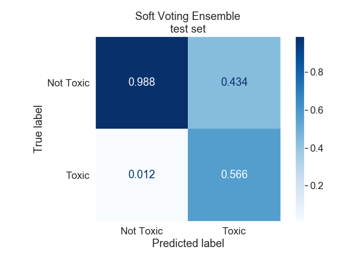

# Automated Moderation
**Identifying Toxic Wikipedia Comments**

## Kin-Yip Chien
[Linkedin](https://www.linkedin.com/in/kinyip-chien/) | [Github](https://github.com/kinyipchien) | [Slides](/presentation/toxic_comments_project-slides.pdf)

## Table of Contents

* [Background and Motivation](#background-and-motivation)
* [Data](#data)
  * [Description](#description)
* [Feature Engineering](#feature-engineering)
  * [Text Vectorization](#text-vectorization)
* [Exploration](#exploration)
  * [Important Words](#important-words)
  * [Distributions](#distributions)
* [Modeling](#modeling)
  * [Train/Test Split](#traintest-split)
  * [Class Imbalance](#class-imbalance)
  * [Model Algorithms](#model-algorithms)
    * [Elastic Net Logistic Regression](#elastic-net-logistic-regression)
    * [LightGBM Gradient-Boosting](#lightgbm-gradient-boosting)
    * [Linear Soft Support Vector Machine](#linear-soft-support-vector-machine)
    * [Multinomial Naive Bayes](#multinomial-naive-bayes)
    * [scikit learn Random Forest](#scikit-learn-Random-Forest)
  * [Final Model (Soft Voting Ensemble)](#final-model-soft-voting-ensemble)
    * [Misclassified Examples](#misclassified-examples)
  * [Model Comparison](#model-comparison)
  * [Test Set Performance](#test-set-performance)
* [Future Directions](#future-directions)
* [References](#references)

## Background and Motivation
Comments sections abound on various websites to facilitate discussion and engagement between users. However, toxic and abusive comments can quickly derail discussions and cause users to permanently refrain from commenting in the future and the scale of the problem is huge.

[11,000 comments](https://www.nytimes.com/interactive/2016/09/20/insider/approve-or-reject-moderation-quiz.html) are posted to the New York Times website every day. Over 160 million comments are posted to Reddit every month. Websites employ full-time human moderators to enforce policies of civility but the job [negatively affects](https://www.theverge.com/2019/2/25/18229714/cognizant-facebook-content-moderator-interviews-trauma-working-conditions-arizona) their mental health.

Machine learning methods can provide solutions that limit moderators' exposure to damaging content and moderate consistently and efficiently at scale. In this project I will build an auto-moderator, in other words, a model to classify whether comments are toxic or not.

## Data
### Description
160,000 comments from Wikipedia discussion pages were annotated by up to 10 human raters through the crowd-sourcing platform Crowdflower. Comments were rated on whether they were toxic or not (meaning whether they were likely to make people leave a discussion.) Additionally, five toxic subtypes that are not mutually exclusive were also annotated (severe toxic, obscene, threat, insult, identity hate), but the features were not used to build models in this project.  

This project uses a [modified kaggle competition version](https://www.kaggle.com/c/jigsaw-toxic-comment-classification-challenge/data) of the data set in order to benchmark model performance, but the unmodified data is [available](https://figshare.com/articles/Wikipedia_Talk_Labels_Toxicity/4563973) from Wikipedia.

## Feature Engineering
Text must be converted into numeric features for machine learning methods to train on.

41 features were manually created, consisting of counts of sets of characters, proportions of sets of characters, counts and proportions of words, counts of lines, and average lengths of words and lines in each comment.

### Text Vectorization
Another way to convert text into numeric data is by vectorization. Word or character level n-grams can be converted into count vectors or tf-idf vectors.  

#### Term Frequency-Inverse Document Frequency
<div align='center'>

</div>

Term frequency-inverse document frequency is a statistic that reflects how important a word is to a document in a corpus. The more frequent a word is within a document and the fewer the documents the word appears in, the higher its tf-df value.

After appropriate train-test splitting of the data set, tf-idf vectorization resulted in a vocabulary close to 60,000 -- in other words, 60,000 features for models to train on.

## Exploration
### Important Words
Tf-idf vectorization was used to rank word importances within the toxic and nontoxic comment classes. The top 10 unique words within each class are (not ordered by importance):  
Toxic: ass, bitch, dick, don', f\*\*k, f\*\*\*ing, like, s\*\*t, stop, stupid, suck.  
Nontoxic: article, good, help, new, section, thank, time, use, 've, wp.  

There is already a clear pattern in the language used in toxic versus nontoxic comments.  

### Distributions
I would like to highlight two interesting differences between toxic and nontoxic comments.

One:
<div align='center'>

</div>
It can be observed that toxic comments (green) tend to be shorter (have fewer characters) than nontoxic comments (black). But toxic comments are also longer, as can be seen by the small peak at the right edge of the graph. Long comments (5000 characters) tend to be strings repeated until the character limit is reached.

</br>
</br>
Two:
<div align='center'>

</div>
It can be observed that toxic comments (green) tend to contain a higher proportion of uppercase characters than nontoxic comments (black). All capitalized text typically indicates shouting and it makes sense that toxic comments have an associated shouting/angry tone.

<br/>
Only tfidf values were used as features for modeling.

## Modeling
### Train/Test Split
The comments were split into a 75% training fold and 25% testing fold to preserve the class imbalance in the test fold.

### Class Imbalance
Approximately 10% of the comments belong to the toxic class, with the remaining comments belonging to the nontoxic class. Highly imbalanced classes will lead to models that perform poorly at identifying the minority class unless the imbalance is specifically addressed. There are various methods for addressing imbalance, including upsampling, downsampling, and changing sample weights in model fit functions. Here we will downsample the majority class to produce a class-balanced training set.

<br/><br/>
### Model Algorithms
A number of model algorithms were used to build classifiers. The choice of character and word n-grams were investigated within each classifier and unigrams produced models with the lowest cross-validation loss. Some classifiers are highlighted below.

#### Elastic Net Logistic Regression
A logistic regression classifier with an elastic net regularization was fit to the training data with hyperparameters tuned by 5-fold cross-validation.
<div align='center'>

</div>
The red bars correspond to the five features most indicative of a toxic comment. They are words that typically have negative valence. The blue bars are features most indicative of nontoxic comments. The heights of the bars correspond to the exponentiated feature coefficients in the classifier with the interpretation that a 1% increase in td-idf value increases the odds of the comment being toxic by the y-axis amount.
<div align='center'>

</div>
The confusion matrix comparing predicted to actual classes shows relatively balanced precision and recall, indicating the original class imbalance issue was appropriately addressed.

#### LightGBM Gradient-Boosting
The LightGBM implemention of a gradient-boosted classifier was fit to the training data with hyperparameters tuned by 5-fold cross-validation.
<div align='center'>

</div>
There are a few options for determining feature importance in gradient-boosted models. Here we observe how many splits in the decision stumps underlying the classifier contain each feature. The grey bars correspond to the 10 most important features for classifying a comment. This type of feature importance does not provide information about the direction of the relationship between features and classes, but we can reasonably conclude that the presence of swear words and insults are highly predictive of toxic comments.
<div align='center'>

</div>
The confusion matrix comparing predicted to actual classes shows relatively balanced precision and recall, indicating the original class imbalance issue was appropriately addressed.

#### Linear Soft Support Vector Machine
A support vector machine (SVM) classifier with a soft margin and linear kernel was fit to the training data with hyperparameters tuned by 5-fold cross-validation.
<div align='center'>

</div>
SVM model coefficients represent the vector orthogonal to the hyperplane separating classes with the vector pointing in the direction of the positive class (here, toxic comments). A classification is made by calculating the dot product of a vectorized comment with the SVM vector of coefficients. A positive dot product indicates the predicted class is toxic, and a negative dot product indicates the predicted class is nontoxic. Important features in this classifier are those features (words) which contribute most to this dot product. Red bars represent features that most contribute to a toxic classification, and blue bars represent features that most contribute to a nontoxic classification.
<div align='center'>

</div>
The confusion matrix comparing predicted to actual classes shows relatively balanced precision and recall, indicating the original class imbalance issue was appropriately addressed.

#### Multinomial Naive Bayes
A multinomial naive bayes classifier was fit to the training data with hyperparameters tuned by 5-fold cross-validation.
<div align='center'>

</div>
Multinomial naive bayes is a generative model, where every feature has a probability associated with the toxic and nontoxic class. Comments are classified as toxic or nontoxic, based on the the highest product of the probabilities associated with each class of its features. Here feature importance is derived by determining which features have the largest proportional difference in class probabilities. The red bars correspond to the top 5 features, where the contribution of the feature to a comment being toxic is 100-300 times the contribution to a comment being nontoxic. Similarly, the blue bars correspond to the 5 features that contribute relatively more to a nontoxic classification than to a toxic classification.
<div align='center'>

</div>
The confusion matrix comparing predicted to actual classes shows relatively balanced precision and recall, indicating the original class imbalance issue was appropriately addressed.

#### scikit learn Random Forest
The scikit learn implementation of Random Forest was fit to the training data with hyperparameters tuned by 5-fold cross-validation.
<div align='center'>

</div>
A measure of feature importance in random forest models is the mean decrease in impurity (mdi) whenever a feature is used in a split. Conceptually, the random forest classifier uses rules to divide the data into smaller and smaller groups, with the hope that the resulting groups will be more pure (less impure) in class. The grey bars represent the 10 features with the highest mdi. Because there are 100 decision trees composing this random forest ensemble, standard deviations can be obtained for each feature's mdi across the trees and are represented by the black lines on top of the grey bars.
<div align='center'>

</div>
The confusion matrix comparing predicted to actual classes shows relatively balanced precision and recall, indicating the original class imbalance issue was appropriately addressed.

### Final Model (Soft Voting Ensemble)
Ensemble models combine the predictions from different models, with the motivation that the ensemble model will make less biased and less varied predictions than the underlying models. Theoretically, different models are randomly biased, so an ensemble will be less biased because the underlying biases will cancel out. Furthermore, the variation in predictions will be reduced by aggregating the underlying model predictions.  

Here we build a 'soft voting' ensemble from the following models chosen for their good predictive performance: multinomial naive bayes, elastic net logistic regression, random forest, and LightGBM gradient boosted classifier. Each model can predict a probability for a comment being toxic, and the ensemble averages those probabilities and classifies a comment as toxic if the probability is greater than 0.5. Support vector machines cannot directly output class probabilities so it was not included in the ensemble. The soft voting ensemble classifier was chosen as the final model for comment classification in this project for reasons outlined in the [Model Comparison](#model-comparison) section.
<div align='center'>

</div>
The confusion matrix comparing predicted to actual classes shows relatively balanced precision and recall, indicating the original class imbalance issue was appropriately addressed.  

#### Misclassified Examples
Comments that the model misclassified were studied to further investigate the model.  

Here is a toxic comment misclassified as nontoxic:
```
...In my humble opinion this draft is a pathetically watered-down rendition of 
what's been discussed and usually agreed upon by everyone except you-know-who. 
Denazification reduced to half a sentence?...
```
The current model cannot understand tone.  

<br><br>

Here is another toxic comment misclassified as nontoxic:
```
 I have to put this as sittign here cackling my head off.  Are you peopel on leave 
 from a psyche hospital?  I just found the following post from prissy Dame Ewart on 
 some other user's talk page.

Its all very weird.  This Gretaw is not me.  It seems she also is offended by Dame 
Sara so good on her.  Fancy this Sarah going to anothers talk page and speakign to 
them as though they are someone else.  That is so wacko.  Shows how you guys are.  
Very delusional.

Its a delicious honour to be blocked from you feral ninnys.  TY for the compliment.  
I just edit on Help.com but really, what a waste of time editing anywhere, especially 
when no one pays for the effort.

Ensure Dame Sarah reads this below the obvious delusional it is.  No one presumes to 
that extent unless the need some help.

Why would I register an accoutn when I wont even sign posts, (too much IT nous for that 
whereas the rest of u dont it seems).  

""User talk:Gretaw
From Wikipedia, the free encyclopedia

Jump to: navigation, search
1.Please assume good faith when dealing with other editors. See Wikipedia:Assume good 
faith for the guidelines on this.  Longhair\talk  
2.Wikipedia guidelines dictate that you assume good faith in dealing with other editors. 
Please stop being uncivil to your fellow editors, and assume that they are here to 
improve Wikipedia. Thank you.  Bidgee  
[edit] Gundagai
Ms Gundagai, normally I would be thrilled to be the centre of so much attention (so far 
all your edits, except those to your userpage, have been devoted to me), but article talk 
pages are for discussing the article, not for making personal attacks on other users. If 
you wish to give me feedback, I would be most interested to read it. The appropriate 
place for such postings is my userpage, not article or project space.
If you truly object to editors ""fiddling...and inteferring with some else's words,"" 
then you might want to consider whether Wikipedia is the right place for you. Every time 
you make an edit, you acknowledge acceptance that your edits may be edited any number of 
times by any number of people. At the bottom of each edit page is this statement: ""If 
you don't want your writing to be edited mercilessly or redistributed by others, do not 
submit it.""
I strongly caution you about continuing to make personal attacks on other users. The 
community condemns personal attacks, and should you choose to continue making them, it 
will result in further and longer range blocks. It's very easy to avoid such blocks by 
simply commenting on article content instead of editors. I'm sure we can all work together 
constructively and productively if we refrain from making comments about other users.
I am very pleased that you now have an account and I think this is a sign of good faith on 
your behalf. So thankyou for that. I hope we are able to get these issues resolved so you 
may be able to enjoy contributing to Wikipedia. Sarah Ewart (Talk) """
```
Because a large portion of the comment quoted another user's comment, the model is unable to handle multiple authorship and classifies the comment as nontoxic, even though the non-quoted portion does have a toxic tone.

<br><br>

Here is a nontoxic comment classified as toxic:
```
hey dude i d like to know who is in charge of all of this deleting that is going on, i did 
a thing on the harly drags, and some punk ass f****t deleted it and i really dont appreciate 
that very much at all, and im kinda very extremely pissed and i think that since it wasnt 
good enough for yall nerds then yall should write abput it , but yall dont have any clue 
what it is cuz you aint been you no p***y gettin guy.... feel free to write me back dude
```
The shortcoming of the current model is that it does not understand tone and only looks for swear words.

<br><br>

Here is another nontoxic comment classified as toxic:
```
But keep in mind I am a gay Jew.
```
The main shortcoming of the current model is again highlighted. It simply determines whether comments are toxic or not based on the presence of offensive words.

### Model Comparison
In a production environment, model evaluation should not be solely based on predictive performance. The time needed to train models and score comments is also important. Below is a table summarizing various model metrics:

| Model                  | Fit Time | Fit std | Score Time | Score std | AUC   | AUC std | 
|------------------------|---------:|--------:|-----------:|----------:|------:|--------:| 
| Linear SVC             | 2.099    | 0.061   | 0.460      | 0.05      | 0.961 | 0.002   |
| Multinomial NB         | 2.521    | 0.172   | 0.509      | 0.09      | 0.951 | 0.002   | 
| Elastic Net Logit      | 2.842    | 0.286   | 0.475      | 0.062     | 0.968 | 0.002   | 
| sklearn RF             | 112.597  | 0.401   | 1.271      | 0.038     | 0.929 | 0.003   | 
| LightGBM Classifier    | 129.962  | 0.806   | 0.894      | 0.141     | 0.967 | 0.002   | 
| **Soft Voting Ensemble\*** | 242.908  | 7.552   | 9.956      | 5.467     | **0.972** | 0.001   | 

\* **final model**

It can be seen that the ensemble model has a higher cross-validated AUC score than the underlying models, illustrating the benefits of model ensembling. The model implementations used in this project were chosen for their fit speed. Some other models, like k-nearest-neighbors, or PCA/NMF/SVD dimensionality reduced models, were observed to have prohibitively long training times and were excluded from further investigation.  

Another observation from the model comparison is that models that linearly separate classes (linear SVC and logistic regression) perform better than models that non-linearly separate classes (random forest), providing some insight into the high-dimensional distribution of classes. The elastic net logistic regression also has a tuned regularization parameter closer to a LASSO regularizer than a ridge regularizer (not shown), indicating that relatively few features are useful in classifying comments.  

Model fitting times were not too long for any model so the soft voting ensemble classifier was chosen as the final model for this project.

### Test Set Performance
Although cross-validation can estimate a model's generalizability by estimating its test set performance, the final model should be evaluated on a holdout test set of the data. 
<div align='center'>

</div>
The model AUC score on the test set was 0.972. However, the confusion matrix comparing predicted to actual classes shows poor performance in identifying toxic comments. It is not clear at this point why this occurs. It is an avenue for further investigation.

## Future Directions
* Investigate discrepancy between test set and training set confusion matrices.  
* Predict the five subclasses.  
* Address unintended bias (explore models that can parse tone and context and not just detect the presence of offensive words.)  

## References
* Etim, Bassey. “Approve or Reject: Can You Moderate Five New York Times Comments?” *New York Times* 20 Sept. 2016, www.nytimes.com/interactive/2016/09/20/insider/approve-or-reject-moderation-quiz.html
* Newton, Casey. “The Secret Lives of Facebook Moderators in America.” *The Verge* 25 Feb. 2019, www.theverge.com/2019/2/25/18229714/cognizant-facebook-content-moderator-interviews-trauma-working-conditions-arizona.
